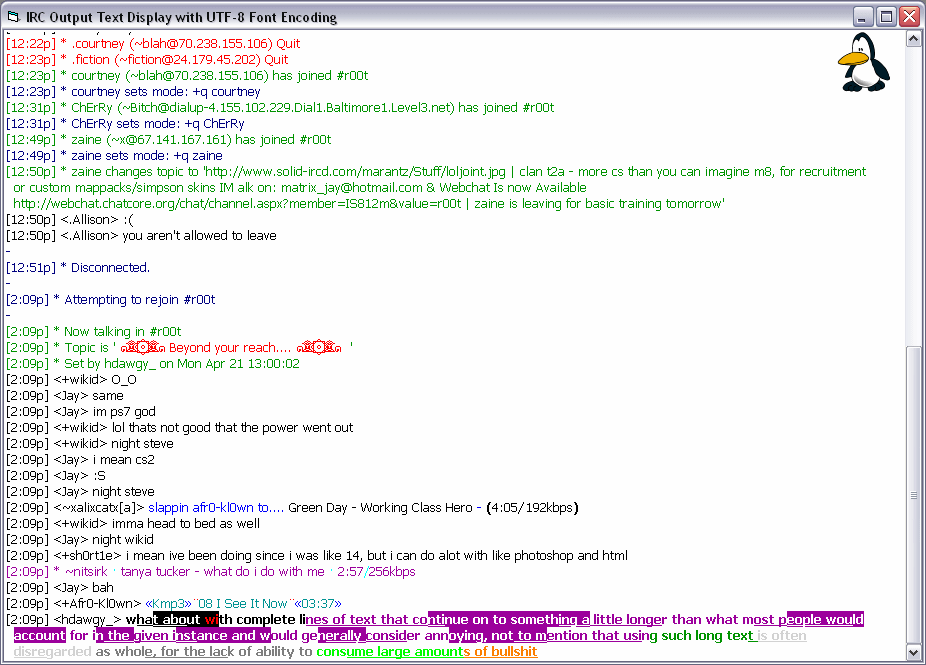



## An IRC Chat Frame Text Control \(Updated\)

### Description

This mIRC-style text output window displays IRC formatted text in a scrollable picturebox and also allows for copying of the lines of text, as well as double clicking on nicknames (if AddNick is implemented), #channel names and URL links, just like mIRC. Another mIRC like feature, is the ability to load background images either stretched, tiled, centered or photo (top right corner). EventColor() array is used to set predetermined IRC color numbers for particular events such as Join, Part, Quit, Action, etc. This has taken me about a year to get working properly and more than likely has one bug, or two, but i hope someone finds it useful. This would be most useful, obviously in an IRC client. There is a reference included "strings.tlb" which is used for the word wrapping routine which must be copied to your windows/system32 folder. Have fun :)

UPDATE: Fixed a few bugs.

UPDATE 2: Added UTF-8 support and loading of part of a log file (useful for onjoin "reload logs" feature like mIRC) - also included a better demo project to show more of its features
 
### More Info
 

             |
---                |---
**Submitted On**   |2008-04-23 08:35:38
**By**             |[Jason Newland](https://github.com/Planet-Source-Code/PSCIndex/blob/master/ByAuthor/jason-newland.md)
**Level**          |Advanced
**User Rating**    |5.0 (10 globes from 2 users)
**Compatibility**  |VB 6\.0
**Category**       |[Graphics](https://github.com/Planet-Source-Code/PSCIndex/blob/master/ByCategory/graphics__1-46.md)
**World**          |[Visual Basic](https://github.com/Planet-Source-Code/PSCIndex/blob/master/ByWorld/visual-basic.md)
**Archive File**   |[An\_IRC\_Cha2110934282008\.zip](https://github.com/Planet-Source-Code/jason-newland-an-irc-chat-frame-text-control-updated__1-70376/archive/master.zip)

